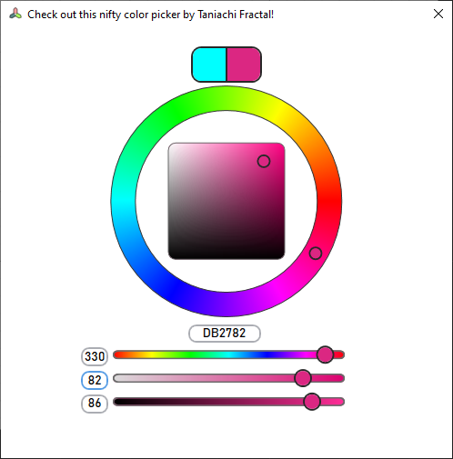

# TaniachiFractal.ColorPicker

Copy the code from [The "ColorPicker" folder](/TaniachiFractal.ColorPicker/ColorPicker) to use in your WPF project! Use ***Ctrl+Shift+H*** to replace ```TaniachiFractal.ColorPicker``` with whatever folder structure you've placed it in. 

If you just want to try it out, open this repository in Visual Studio and build the test showcase app.


